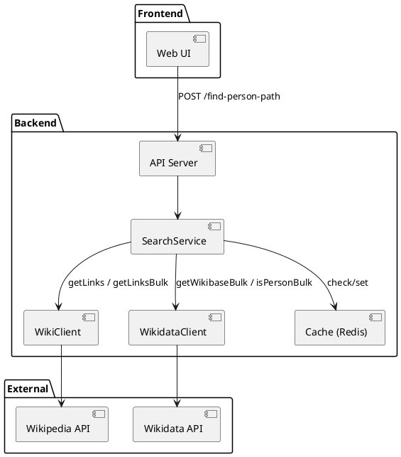
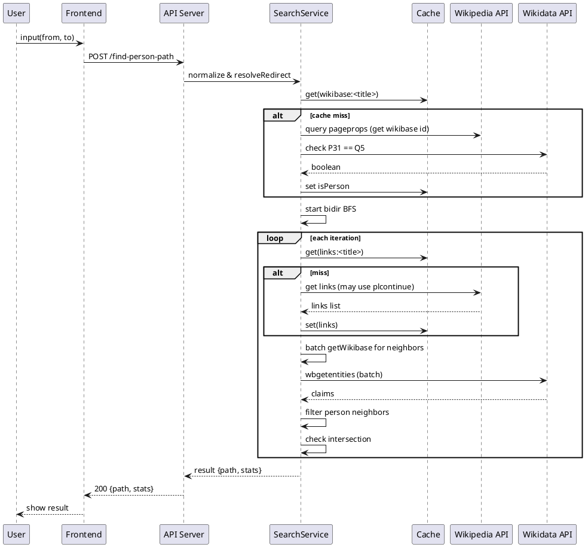
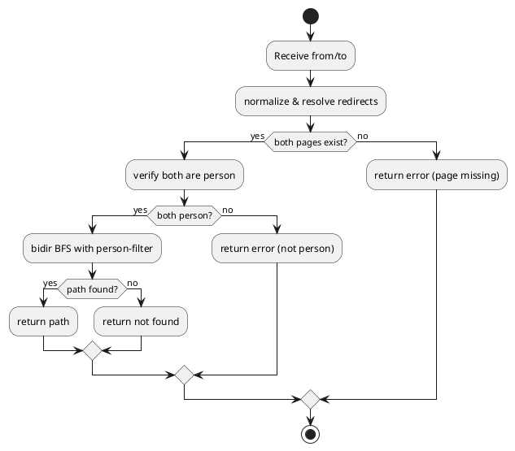

# Six Degrees (phiên bản chỉ giữa 2 người nổi tiếng) — Tổng quan & UML

Tài liệu này cung cấp cái nhìn toàn cảnh về dự án: mục tiêu, kiến trúc, luồng người dùng, luồng dữ liệu, và các sơ đồ UML minh họa (component, sequence, activity). Bạn có thể dùng tài liệu này làm 'bản đồ' khi code.

---

## 1. Mục tiêu ngắn gọn

- Tìm **đường ngắn nhất** giữa hai **người nổi tiếng** trên Wikipedia (chỉ qua các trang được xác nhận là _person_).
- Backend: Node.js + Express; Frontend: React (tùy chọn).
- Data sources: **Wikipedia API** (links, pageprops) + **Wikidata API** (xác nhận P31 = Q5).
- Thuật toán chính: **Bidirectional BFS** với batch lookups & cache.

---

## 2. Kiến trúc thành phần (Component overview)

- **Client (Frontend)**: Form nhập `from` & `to` → gọi API → hiển thị path + stats.
- **API Server (Backend)**

  - Endpoint: `POST /find-person-path`
  - Modules: utils (normalize/resolve), wiki client (getLinks, getLinksBulk), wikidata client (getWikibaseBulk, isPersonBulk), search (bidir bfs), cache layer (Redis/node-cache), throttle/queue.

- **External APIs**: Wikipedia REST/API, Wikidata API.
- **Optional**: Redis (cache), Offline graph DB (Neo4j / SQLite) cho scale.

---

## 3. Luồng người dùng (User flow)

1. Người dùng nhập hai tên người nổi tiếng trên giao diện và bấm `Tìm`.
2. Frontend gửi `POST /find-person-path` với body `{ from, to, maxDepth }`.
3. Backend:

   - Normalize & resolve redirect cho cả 2 trang.
   - Kiểm tra 2 trang có phải person (Wikidata) — nếu không, trả lỗi.
   - Chạy **bidirectional BFS**: mở rộng frontier nhỏ hơn, mỗi bước lấy links → batch lấy wikibase ids → batch kiểm tra isPerson → build next frontier.
   - Nếu hai frontier gặp nhau: reconstruct path và trả JSON kết quả.

4. Frontend hiển thị path (breadcrumb + link tới Wikipedia) và các thống kê (steps, elapsed_ms, nodes_explored, api_calls).

---

## 4. Luồng dữ liệu (Data flow)

- Input: `from`, `to` (text)
- Transforms:

  - normalizeTitle -> canonicalTitle (resolveRedirect)
  - getLinks(title) -> danh sách tiêu đề liên kết (cached)
  - getWikibaseItemsBulk(titles) -> title -> Qid
  - isPersonBulk(Qids) -> Qid -> boolean

- Output: `path: [Title...], steps, stats`

---

## 5. Endpoint API (tóm tắt)

- **POST /find-person-path**

  - Body: `{ from: string, to: string, maxDepth?: number }`
  - Success: `200 { path: [...], steps: N, elapsed_ms, stats: {...} }`
  - Error: 4xx nếu input invalid hoặc page missing

---

## 6. UML diagrams

> Dưới đây có các sơ đồ UML để minh họa — mình cung cấp cả PlantUML blocks để bạn có thể copy chạy trong PlantUML nếu muốn.

### 6.1 Component Diagram (PlantUML)

### 6.2 Sequence Diagram (PlantUML) — tìm path

### 6.3 Activity Diagram (simple)

---

## 7. Metrics & Observability (gợi ý)

- `api_calls_wikipedia`, `api_calls_wikidata` (counters)
- `cache_hit_links`, `cache_hit_person` (ratios)
- `nodes_explored_per_query`, `avg_elapsed_ms`
- Log trace cho queries chậm (>2s)

---

## 8. Next steps gợi ý

- Tạo skeleton repo & triển khai MVP theo tài liệu này.
- Thử vài queries, bật log để xem `api_calls` và `cache_hit_rate`.
- Nếu cache hit low / latency cao -> cân nhắc offline people-only graph.

---

_Bạn có thể mở rộng hoặc yêu cầu mình chỉnh sơ đồ UML (ví dụ thêm class diagram chi tiết cho modules, hoặc render PNG PlantUML)._
